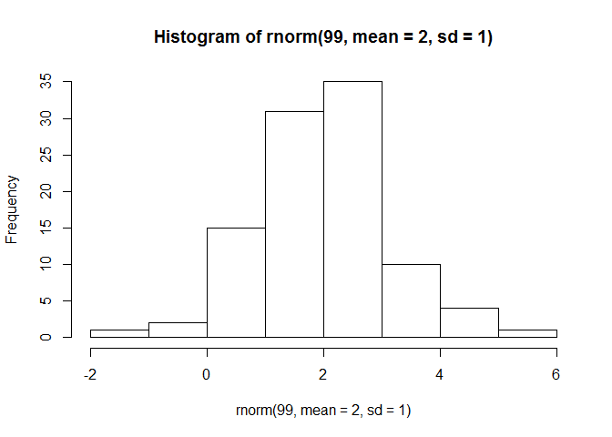
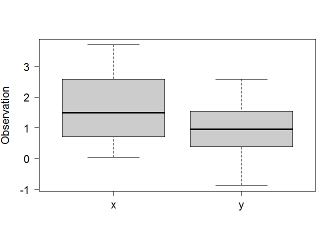
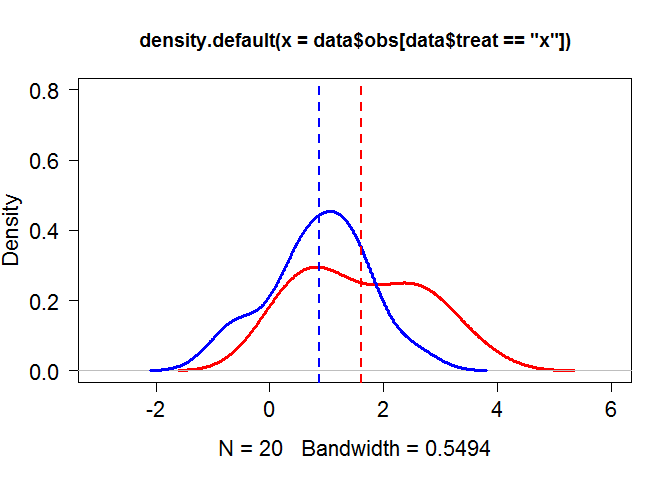
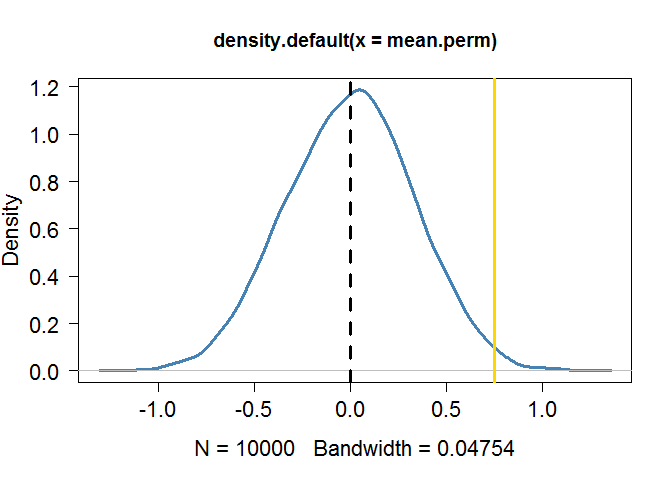
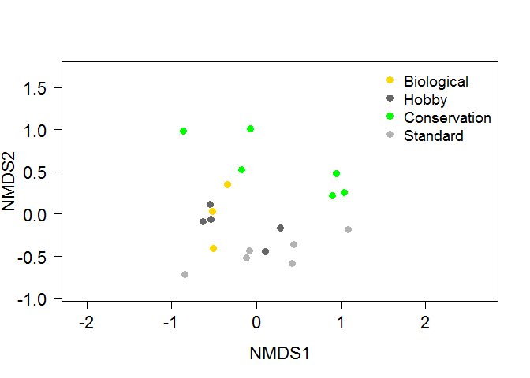

# Stats Cafe - simulations and resampling (in R)
Jochen Fründ, Michael Staab  
January to February 2017  


----

# Session 1 (18 Jan 2017): Overview
(Jochen Fründ)

## Intro
On overview of statistical methods using simulation or resampling is given. These methods have in common that they simulate sampling (ultimately based on random number generators in computers), rather than relying on mathematical relationships established for known probability distributions.


On the presentation slides, different statistical methods based on simulation and resampling were categorized into four classes
* randomization / permutation (shuffling data, without replacement; useful e.g. for testing differences between groups)
* bootstrap (resampling with replacement; useful e.g. for estimating parameter uncertainty)
* jackknife and cross-validation (leaving out part of the data, sampling without replacement; useful e.g. for estimating prediction uncertainty)
* Monte Carlo (stricter def.) methods (simulating from a given distribution; useful e.g. for validating or understanding model behavior)

Basically, any statistic/index that you calculate from your data can be tested and analysed with such methods (no problem if it has a weird or unknown distribution). For your 'test statistic', you should consider
* does it reflect what you are interested in? (e.g. influence of abundance may or may not be wanted for community similarity)
* is it influenced by sample size ? (e.g. species richness is underestimated in small samples)
The second point is an important issue particularly for bootstrap and jackknife that don't use all of the original data.


```r
knitr::include_graphics("figures/OverviewResamplingMethods.png")  # shows an illustration of the differences between sampling methods
```


## R code

A simple starting pointing for R-code may be some invented data:

```r
mydata <- 1:20   # some data of unknown distribution (could be an index of insect diversity or an index of crown density, or ...)
mygroups <- rep(c("hardwood","softwood"), 10)
```

For simulation and resampling, the `sample` function is your best friend. Basically, with `replace=TRUE` you can implement bootstrap methods, and with `replace=FALSE` (the default) randomization and jackknife.
A note of caution when using `sample` in functions etc.: if given a single number, it will sample from all numbers in the range from 1 to this number.


```r
sample(c(2,3,5), 3) # samples without replacement out of numbers 2, 3 and 5
```

```
## [1] 3 2 5
```

```r
sample(c(2,3,5), 3, replace=TRUE) # samples with replacement
```

```
## [1] 3 5 2
```

```r
sample(3, 3, replace=TRUE)  # this is NOT just sampling from the single element 3
```

```
## [1] 1 2 1
```

Another useful advice may be that computer-generated random numbers are just pseudo-random numbers. They do a good job in simulating randomness, but you can get a reproducible example by setting the random seed with `set.seed()`.


Now, I will show a randomization test, a bootstrap example and a jack-knife example.

## Randomization / Permutation

We may be interested in whether the values (let's call them insect diversity) are different between hardwood and softwood.


```r
tapply(mydata, mygroups, mean)
```

```
## hardwood softwood 
##       10       11
```

```r
groupmeans <- tapply(mydata, mygroups, mean)
groupmeans[1] - groupmeans[2]  # calculates the observed difference
```

```
## hardwood 
##       -1
```
Ok, the mean of hardwood is lower than the mean of softwood. But is this significant?
The null hypothesis is that the label hardwood or softwood does not matter for our response variable (index of insect diversity). This can be simulated by randomly assigning these labels.


```r
mydata.ran <- sample(mydata, replace=FALSE)
groupmeans.ran <- tapply(mydata.ran, mygroups, mean) # you could also sample mygroups instead of mydata, the idea is to break the association between the two vectors
groupmeans.ran[1] - groupmeans.ran[2]
```

```
## hardwood 
##        4
```

Next would be to do this sampling a lot of times (or take all possible combinations = permutation), to get a null distribution, to which the observed value (-1) can be compared.


```r
meandif.ran <- function(mydata, mygroups){
  mydata.ran <- sample(mydata, replace=FALSE)
  groupmeans.ran <- tapply(mydata.ran, mygroups, mean)
  groupmeans.ran[1] - groupmeans.ran[2]
}
meandifs.ran <- replicate(5000, meandif.ran(mydata, mygroups))
hist(meandifs.ran, xlab= "difference in means")
abline(v= groupmeans[1] - groupmeans[2], col="red", lwd=2)
```

<!-- -->

In this case, the observed difference in means (red line) is right in the middle of randomizations, so if values were the result of real sampling, hardwood and softwood would not be significantly different.


## Bootstrap

If we want to quantify the uncertainty of the overall mean (e.g. to test it against a literature value), we cannot use randomization -- each permutation has the same mean. But we can do this with bootstrap.


```r
mydata.ran <- sample(mydata, replace=TRUE)
mean(mydata.ran)
```

```
## [1] 8.2
```


```r
quantile(replicate(5000, mean(sample(mydata, replace=TRUE))), c(0.025, 0.975))
```

```
##  2.5% 97.5% 
##     8    13
```
This gives lower and upper confidence limits of the overall mean.


## Jackknife and Cross Validation

These methods have in common that (randomly selected) parts of the data are left out. Leaving out one datapoint is called first-order jackknife:

```r
mydata[-(sample(length(mydata), 1))]
```

```
##  [1]  1  2  3  4  5  6  7  8  9 10 11 12 13 14 15 16 18 19 20
```

This can also give an estimate of uncertainty, which of course has to be interpreted differently than the bootstrap confidence limits:


```r
quantile(replicate(5000, mean(mydata[-(sample(length(mydata), 1))])), c(0.025, 0.975))
```

```
##  2.5% 97.5% 
##    10    11
```


## Monte Carlo

Often simulations not just based on `sample`, but use functions `rnorm` (random numbers from a normal distribution), `rpois` (from a Poisson distribution), etc.
For example:


```r
hist(rnorm(99, mean=2, sd=1))
```

<!-- -->

But also the `sample` function may still be useful. Note that it also has a `prob` argument, which can assign different probabilities to the different elements being sampled.


----

# Session 2 (01 Feb 2017): Permutation / Randomization
(Michael Staab)

This session provided more detailed examples of randomization tests, especially using functions commonly used in community ecology.
See also accompanying slides.


```r
# generate some data

xx <- rnorm(n=20, mean=1.6, sd=1)
yy <- rnorm(n=20, mean=1, sd=1)


## xx <- rpois(n=20, lambda=7)	# works also for other data types; try it
## yy <- rpois(n=20, lambda=5)


# assemble the dataset
data <-data.frame(c(xx,yy))
names(data) <- "obs"
data[,"treat"] <- c(rep("x", 20), rep("y", 20))
str(data)
```

```
## 'data.frame':	40 obs. of  2 variables:
##  $ obs  : num  2.73 2.53 1.37 3.18 3.08 ...
##  $ treat: chr  "x" "x" "x" "x" ...
```

```r
head(data)
```

```
##        obs treat
## 1 2.730877     x
## 2 2.526872     x
## 3 1.372141     x
## 4 3.183749     x
## 5 3.083549     x
## 6 1.247332     x
```

```r
# illustrate the data
boxplot(obs ~ treat, names=c("x","y"), cex.axis=1.4, las=1, ylab="Observation",
	cex.lab=1.4, col="grey80", data=data)
```

<!-- -->

```r
plot(density(data$obs[data$treat=="x"]), xlim=c(-3,6), ylim=c(0,0.8), col="red", lwd=3, las=1,
	cex.axis=1.4, cex.lab=1.4)
lines(density(data$obs[data$treat=="y"]), col="blue", lwd=3)
abline(v=mean(data$obs[data$treat=="x"]), col="red", lwd=2, lty=2)
abline(v=mean(data$obs[data$treat=="y"]), col="blue", lwd=2, lty=2)
```

<!-- -->

## simple permutation test


```r
# we are interested in the differences between the means
mean.obs <- mean(data$obs[data$treat=="x"]) - mean(data$obs[data$treat=="y"])


# how many permutations?
n.perm <- 10000
mean.perm <- rep(0, n.perm)
for(i in 1:n.perm) {					# write a short loop
	
	perm.obs <- sample(data$obs)			# that is the crucial step: sample your data (without replacement, replace=F is default)
	perm.data <- data.frame(perm.obs)		# reassemble the dataset, this is here mostly for illustrative purpose
	perm.data[,"treat"] <- c(data$treat)
	names(perm.data) <- c("obs", "treat")
		
	mean.perm[i] <- mean(perm.data$obs[perm.data$treat=="x"]) - mean(perm.data$obs[perm.data$treat=="y"])
	}

# illustrate what we actually did
plot(density(mean.perm), lwd=3, col="steelblue", las=1, cex.axis=1.4, cex.lab=1.4)	# density of our permutations
abline(v=mean.obs, lwd=3, col='gold')		# this is the observed difference in means
abline(v=mean(mean.perm), lwd=3, lty=2)
```

<!-- -->

```r
p.val <- sum(abs(mean.perm) > abs(mean.obs)) / length(mean.perm)	# two-tailed test
p.val
```

```
## [1] 0.0137
```

```r
# ifelse(p.val > 0.5, 1-p.val, p.val)
t.test(xx, yy)		# not so different to a t-test
```

```
## 
## 	Welch Two Sample t-test
## 
## data:  xx and yy
## t = 2.6209, df = 37.598, p-value = 0.01258
## alternative hypothesis: true difference in means is not equal to 0
## 95 percent confidence interval:
##  0.1809188 1.4108134
## sample estimates:
## mean of x mean of y 
##  1.793183  0.997317
```


## example for community data


```r
require(vegan)
```

```
## Loading required package: vegan
```

```
## Loading required package: permute
```

```
## Loading required package: lattice
```

```
## This is vegan 2.4-1
```

```r
# get the data
data(dune); str(dune)
```

```
## 'data.frame':	20 obs. of  30 variables:
##  $ Achimill: num  1 3 0 0 2 2 2 0 0 4 ...
##  $ Agrostol: num  0 0 4 8 0 0 0 4 3 0 ...
##  $ Airaprae: num  0 0 0 0 0 0 0 0 0 0 ...
##  $ Alopgeni: num  0 2 7 2 0 0 0 5 3 0 ...
##  $ Anthodor: num  0 0 0 0 4 3 2 0 0 4 ...
##  $ Bellpere: num  0 3 2 2 2 0 0 0 0 2 ...
##  $ Bromhord: num  0 4 0 3 2 0 2 0 0 4 ...
##  $ Chenalbu: num  0 0 0 0 0 0 0 0 0 0 ...
##  $ Cirsarve: num  0 0 0 2 0 0 0 0 0 0 ...
##  $ Comapalu: num  0 0 0 0 0 0 0 0 0 0 ...
##  $ Eleopalu: num  0 0 0 0 0 0 0 4 0 0 ...
##  $ Elymrepe: num  4 4 4 4 4 0 0 0 6 0 ...
##  $ Empenigr: num  0 0 0 0 0 0 0 0 0 0 ...
##  $ Hyporadi: num  0 0 0 0 0 0 0 0 0 0 ...
##  $ Juncarti: num  0 0 0 0 0 0 0 4 4 0 ...
##  $ Juncbufo: num  0 0 0 0 0 0 2 0 4 0 ...
##  $ Lolipere: num  7 5 6 5 2 6 6 4 2 6 ...
##  $ Planlanc: num  0 0 0 0 5 5 5 0 0 3 ...
##  $ Poaprat : num  4 4 5 4 2 3 4 4 4 4 ...
##  $ Poatriv : num  2 7 6 5 6 4 5 4 5 4 ...
##  $ Ranuflam: num  0 0 0 0 0 0 0 2 0 0 ...
##  $ Rumeacet: num  0 0 0 0 5 6 3 0 2 0 ...
##  $ Sagiproc: num  0 0 0 5 0 0 0 2 2 0 ...
##  $ Salirepe: num  0 0 0 0 0 0 0 0 0 0 ...
##  $ Scorautu: num  0 5 2 2 3 3 3 3 2 3 ...
##  $ Trifprat: num  0 0 0 0 2 5 2 0 0 0 ...
##  $ Trifrepe: num  0 5 2 1 2 5 2 2 3 6 ...
##  $ Vicilath: num  0 0 0 0 0 0 0 0 0 1 ...
##  $ Bracruta: num  0 0 2 2 2 6 2 2 2 2 ...
##  $ Callcusp: num  0 0 0 0 0 0 0 0 0 0 ...
```

```r
data(dune.env); str(dune.env)
```

```
## 'data.frame':	20 obs. of  5 variables:
##  $ A1        : num  2.8 3.5 4.3 4.2 6.3 4.3 2.8 4.2 3.7 3.3 ...
##  $ Moisture  : Ord.factor w/ 4 levels "1"<"2"<"4"<"5": 1 1 2 2 1 1 1 4 3 2 ...
##  $ Management: Factor w/ 4 levels "BF","HF","NM",..: 4 1 4 4 2 2 2 2 2 1 ...
##  $ Use       : Ord.factor w/ 3 levels "Hayfield"<"Haypastu"<..: 2 2 2 2 1 2 3 3 1 1 ...
##  $ Manure    : Ord.factor w/ 5 levels "0"<"1"<"2"<"3"<..: 5 3 5 5 3 3 4 4 2 2 ...
```

```r
# simple odination for illustration
nmds_1 <- metaMDS(dune, distance = "bray")
```

```
## Run 0 stress 0.1192678 
## Run 1 stress 0.1183186 
## ... New best solution
## ... Procrustes: rmse 0.02027041  max resid 0.06495625 
## Run 2 stress 0.1192679 
## Run 3 stress 0.1192679 
## Run 4 stress 0.1183186 
## ... Procrustes: rmse 3.722212e-05  max resid 0.000122463 
## ... Similar to previous best
## Run 5 stress 0.1192678 
## Run 6 stress 0.1183186 
## ... Procrustes: rmse 2.898153e-05  max resid 9.136757e-05 
## ... Similar to previous best
## Run 7 stress 0.1183186 
## ... Procrustes: rmse 1.045585e-05  max resid 3.232683e-05 
## ... Similar to previous best
## Run 8 stress 0.1183186 
## ... New best solution
## ... Procrustes: rmse 4.981788e-06  max resid 1.526516e-05 
## ... Similar to previous best
## Run 9 stress 0.1192683 
## Run 10 stress 0.1192685 
## Run 11 stress 0.1192679 
## Run 12 stress 0.1192678 
## Run 13 stress 0.1982895 
## Run 14 stress 0.2858526 
## Run 15 stress 0.1183186 
## ... Procrustes: rmse 5.555594e-05  max resid 0.0001755001 
## ... Similar to previous best
## Run 16 stress 0.1808914 
## Run 17 stress 0.1183187 
## ... Procrustes: rmse 0.0001439311  max resid 0.0004292573 
## ... Similar to previous best
## Run 18 stress 0.1192678 
## Run 19 stress 0.1192679 
## Run 20 stress 0.1192679 
## *** Solution reached
```

```r
nmds_1
```

```
## 
## Call:
## metaMDS(comm = dune, distance = "bray") 
## 
## global Multidimensional Scaling using monoMDS
## 
## Data:     dune 
## Distance: bray 
## 
## Dimensions: 2 
## Stress:     0.1183186 
## Stress type 1, weak ties
## Two convergent solutions found after 20 tries
## Scaling: centring, PC rotation, halfchange scaling 
## Species: expanded scores based on 'dune'
```

```r
plot(nmds_1, type="n", cex.axis=1.4, cex.lab=1.4, las=1)
points(scores(nmds_1, display=c("sites"))[,1], scores(nmds_1, display=c("sites"))[,2], 
	pch=c(19), col=c("grey50"), cex=1.2)	# add the plots
```

<!-- -->

```r
# influence of the environment
str(dune.env)
```

```
## 'data.frame':	20 obs. of  5 variables:
##  $ A1        : num  2.8 3.5 4.3 4.2 6.3 4.3 2.8 4.2 3.7 3.3 ...
##  $ Moisture  : Ord.factor w/ 4 levels "1"<"2"<"4"<"5": 1 1 2 2 1 1 1 4 3 2 ...
##  $ Management: Factor w/ 4 levels "BF","HF","NM",..: 4 1 4 4 2 2 2 2 2 1 ...
##  $ Use       : Ord.factor w/ 3 levels "Hayfield"<"Haypastu"<..: 2 2 2 2 1 2 3 3 1 1 ...
##  $ Manure    : Ord.factor w/ 5 levels "0"<"1"<"2"<"3"<..: 5 3 5 5 3 3 4 4 2 2 ...
```

```r
# lets have a look at the effect of management
plot(nmds_1, type="n", cex.axis=1.4, cex.lab=1.4, las=1)
points(scores(nmds_1, display=c("sites"))[,1], scores(nmds_1, display=c("sites"))[,2], 
	pch=c(19), col=c("gold", "grey40", "green", "grey70")[dune.env$Management], cex=1.2)	# add the plots
legend("topright", c("Biological","Hobby","Conservation","Standard"), bty="n", cex=1.2, pch=19, col=c("gold","grey40","green","grey70"))
```

<!-- -->

## `anosim`: Analysis of Similarities
* rank-based method relying on dissimilarity ranks
* only categories
* limited output

### effect of management?


```r
dune.ano <- anosim(dune, grouping=dune.env$Management, permutations = 1000, distance = "bray")
summary(dune.ano) 
```

```
## 
## Call:
## anosim(dat = dune, grouping = dune.env$Management, permutations = 1000,      distance = "bray") 
## Dissimilarity: bray 
## 
## ANOSIM statistic R: 0.2579 
##       Significance: 0.007992 
## 
## Permutation: free
## Number of permutations: 1000
## 
## Upper quantiles of permutations (null model):
##   90%   95% 97.5%   99% 
## 0.117 0.156 0.191 0.231 
## 
## Dissimilarity ranks between and within classes:
##         0%   25%    50%     75%  100%   N
## Between  4 58.50 104.00 145.500 188.0 147
## BF       5 15.25  25.50  41.250  57.0   3
## HF       1  7.25  46.25  68.125  89.5  10
## NM       6 64.75 124.50 156.250 181.0  15
## SF       3 32.75  53.50  99.250 184.0  15
```


## alternative `adonis`: Permutational Multivariate Analysis of Variance Using Distance Matrices


```r
dune.adonis <- adonis(dune ~ Management, data=dune.env, permutations=1000, dist="bray")
dune.adonis		# be aware: those are pseudo-values (F, R?,...)
```

```
## 
## Call:
## adonis(formula = dune ~ Management, data = dune.env, permutations = 1000,      dist = "bray") 
## 
## Permutation: free
## Number of permutations: 1000
## 
## Terms added sequentially (first to last)
## 
##            Df SumsOfSqs MeanSqs F.Model      R2   Pr(>F)   
## Management  3    1.4686 0.48953  2.7672 0.34161 0.005994 **
## Residuals  16    2.8304 0.17690         0.65839            
## Total      19    4.2990                 1.00000            
## ---
## Signif. codes:  0 '***' 0.001 '**' 0.01 '*' 0.05 '.' 0.1 ' ' 1
```

```r
summary(dune.adonis) # the output offers a range of parameters that may be of interest
```

```
##              Length Class  Mode   
## aov.tab         6   anova  list   
## call            5   -none- call   
## coefficients  120   -none- numeric
## coef.sites     80   -none- numeric
## f.perms      1000   -none- numeric
## model.matrix   80   -none- numeric
## terms           3   terms  call
```

```r
dune.adonis$aov.tab
```

```
## Permutation: free
## Number of permutations: 1000
## 
## Terms added sequentially (first to last)
## 
##            Df SumsOfSqs MeanSqs F.Model      R2   Pr(>F)   
## Management  3    1.4686 0.48953  2.7672 0.34161 0.005994 **
## Residuals  16    2.8304 0.17690         0.65839            
## Total      19    4.2990                 1.00000            
## ---
## Signif. codes:  0 '***' 0.001 '**' 0.01 '*' 0.05 '.' 0.1 ' ' 1
```

```r
#plot(density(dune.adonis$f.perms))
dune.adonis$coefficients
```

```
##               Achimill   Agrostol   Airaprae   Alopgeni  Anthodor
## (Intercept)  1.0083333  2.0583333  0.2083333  1.6500000 1.1166667
## Management1  1.3250000 -2.0583333 -0.2083333 -0.9833333 0.2166667
## Management2  0.1916667 -0.6583333 -0.2083333 -0.0500000 0.6833333
## Management3 -0.6750000  0.1083333  0.6250000 -1.6500000 0.2166667
##               Bellpere   Bromhord    Chenalbu    Cirsarve   Comapalu
## (Intercept)  0.7666667  0.9916667  0.04166667  0.08333333  0.1666667
## Management1  0.9000000  1.6750000 -0.04166667 -0.08333333 -0.1666667
## Management2 -0.3666667 -0.1916667 -0.04166667 -0.08333333 -0.1666667
## Management3 -0.4333333 -0.9916667 -0.04166667 -0.08333333  0.5000000
##              Eleopalu      Elymrepe    Empenigr   Hyporadi   Juncarti
## (Intercept)  1.075000  1.333333e+00  0.08333333  0.4583333  0.8166667
## Management1 -1.075000 -4.556259e-16 -0.08333333  0.2083333 -0.8166667
## Management2 -0.275000  6.666667e-01 -0.08333333 -0.4583333  0.7833333
## Management3  1.091667 -1.333333e+00  0.25000000  0.7083333  0.3500000
##               Juncbufo   Lolipere   Planlanc    Poaprat    Poatriv
## (Intercept)  0.5916667  3.3333333  1.4583333  2.6416667  3.2833333
## Management1 -0.5916667  2.6666667  0.5416667  1.3583333  0.3833333
## Management2  0.6083333  0.6666667  1.5416667  0.7583333  1.5166667
## Management3 -0.5916667 -3.0000000 -0.6250000 -1.9750000 -3.2833333
##               Ranuflam   Rumeacet   Sagiproc   Salirepe   Scorautu
## (Intercept)  0.6000000  0.8833333  0.9500000  0.4583333  2.9083333
## Management1 -0.6000000 -0.8833333 -0.2833333 -0.4583333  1.4250000
## Management2 -0.2000000  2.3166667 -0.1500000 -0.4583333 -0.1083333
## Management3  0.7333333 -0.8833333 -0.4500000  1.3750000  0.2583333
##             Trifprat   Trifrepe   Vicilath   Bracruta   Callcusp
## (Intercept)     0.45  2.6583333  0.2916667  2.4083333  0.4166667
## Management1    -0.45  2.0083333  0.7083333 -0.4083333 -0.4166667
## Management2     1.35  0.1416667 -0.2916667  0.3916667 -0.4166667
## Management3    -0.45 -0.8250000 -0.1250000  0.4250000  0.7500000
```

```r
### also possible for continuous predictors and interactions
dune.adonis_A1 <- adonis(dune ~ A1 * Management, data=dune.env, permutations=1000, dist="bray")
dune.adonis_A1
```

```
## 
## Call:
## adonis(formula = dune ~ A1 * Management, data = dune.env, permutations = 1000,      dist = "bray") 
## 
## Permutation: free
## Number of permutations: 1000
## 
## Terms added sequentially (first to last)
## 
##               Df SumsOfSqs MeanSqs F.Model      R2   Pr(>F)   
## A1             1    0.7230 0.72295  4.8187 0.16817 0.002997 **
## Management     3    1.1865 0.39551  2.6362 0.27600 0.004995 **
## A1:Management  3    0.5892 0.19639  1.3090 0.13705 0.230769   
## Residuals     12    1.8004 0.15003         0.41878            
## Total         19    4.2990                 1.00000            
## ---
## Signif. codes:  0 '***' 0.001 '**' 0.01 '*' 0.05 '.' 0.1 ' ' 1
```

```r
str(dune.env)
```

```
## 'data.frame':	20 obs. of  5 variables:
##  $ A1        : num  2.8 3.5 4.3 4.2 6.3 4.3 2.8 4.2 3.7 3.3 ...
##  $ Moisture  : Ord.factor w/ 4 levels "1"<"2"<"4"<"5": 1 1 2 2 1 1 1 4 3 2 ...
##  $ Management: Factor w/ 4 levels "BF","HF","NM",..: 4 1 4 4 2 2 2 2 2 1 ...
##  $ Use       : Ord.factor w/ 3 levels "Hayfield"<"Haypastu"<..: 2 2 2 2 1 2 3 3 1 1 ...
##  $ Manure    : Ord.factor w/ 5 levels "0"<"1"<"2"<"3"<..: 5 3 5 5 3 3 4 4 2 2 ...
```

Both methods (`anosim` and `adonis`) allow the incorporation of blocked/nested designs
* data only permuted within their group
* specified by a vector containing categorial info: `strata=data$block`

