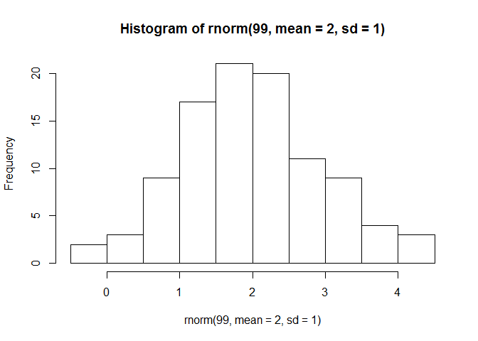
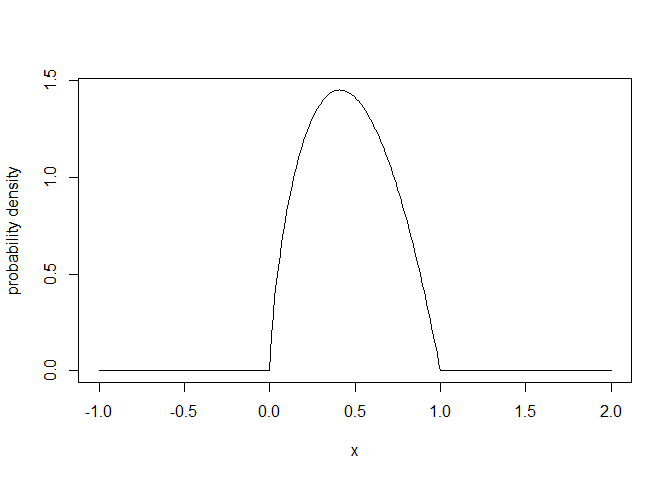
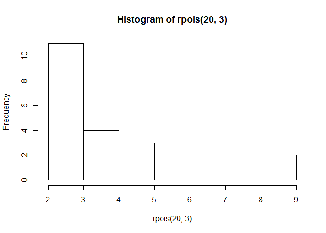
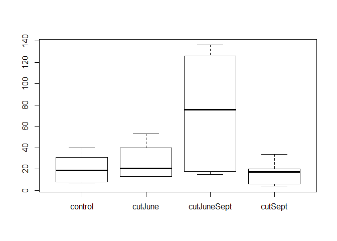
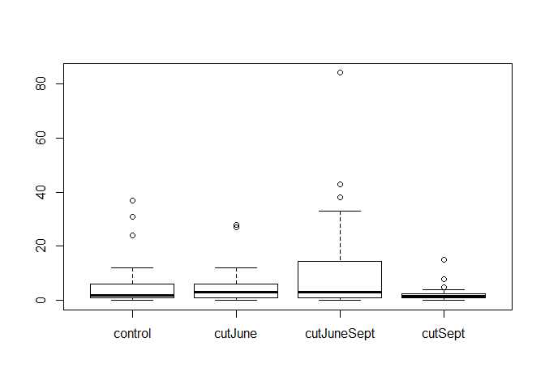

# Stats Cafe - simulations and resampling (in R), Session 5, "Monte Carlo simulations" (sampling from distributions)
Jochen Fründ  
15 March 2017  

----

## Repetition
An overview of statistical methods using simulation or resampling is given. These methods have in common that they simulate sampling (ultimately based on random number generators in computers), rather than relying on mathematical relationships established for known probability distributions.

Different statistical methods based on simulation and resampling were categorized into four classes

* randomization / permutation (shuffling data, without replacement; useful e.g. for testing differences between groups)
* bootstrap (resampling with replacement; useful e.g. for estimating parameter uncertainty)
* jackknife and cross-validation (leaving out part of the data, sampling without replacement; useful e.g. for estimating prediction uncertainty)
* Monte Carlo (stricter def.) methods (simulating from a given distribution; useful e.g. for validating or understanding model behavior)


```r
# knitr::include_graphics("figures/OverviewResamplingMethods.png")  # shows an illustration of the differences between sampling methods
```

... and for Monte Carlo, we had:

Often simulations not just based on `sample`, but use functions `rnorm` (random numbers from a normal distribution), `rpois` (from a Poisson distribution), etc.
Check out `?rnorm` to see that for any distribution build into R, there are usually four functions, one of which allowing to simulate sampling from this distribution (with given parameters).
For example:


```r
hist(rnorm(99, mean=2, sd=1))
```

<!-- -->

But also the `sample` function may still be useful. Note that it also has a `prob` argument, which can assign different probabilities to the different elements being sampled.


**So today**: Inventing data for validating your methods (simulations from known distributions and models)
Playing around with simulated data can be very useful, either before you start a big experiment or survey, or later on if you are unsure whether you (or reviewers) should believe in your methods and results. I'll give an overview of approaches for "playing around".


## Some Basics

We want to simulate (sample) from a given distribution. R has many distributions build in, which always come as a set of functions `d...`, `p...`, `q...`, `r...`, where `...` is a short name for the distribution and `r` is the the random number generator; the others are also useful, but not so important today. See `?Distributions` for a list of distributions available like this.


```r
# there are many distributions! e.g. Beta distribution
plot(seq(-1, 2, by=0.01), dbeta(seq(-1, 2, by=0.01), 1.7, 2), type="l", ylab="probability density", xlab="x")
```

<!-- -->

```r
# random numbers drawn from a distribution, e.g. Poisson
rpois(5, 2)
```

```
## [1] 2 0 4 2 1
```

```r
rpois(5, 2)
```

```
## [1] 1 2 2 3 3
```

```r
# setting the seed creates reproducible randomness
set.seed(3)
rpois(5, 2)
```

```
## [1] 1 3 1 1 2
```

```r
set.seed(3)
rpois(5, 2)
```

```
## [1] 1 3 1 1 2
```

Playing around with simulated randomness can have pedagogical / therapeutic effects. For example, maybe you've gotten used to considering a significant finding as truth or prove?

```r
set.seed(2)
replicate(20, cor.test(rnorm(6), rnorm(6)), simplify=FALSE)  # [2] and [10] are highly significant! 
```

```
## [[1]]
## 
## 	Pearson's product-moment correlation
## 
## data:  rnorm(6) and rnorm(6)
## t = 2.082, df = 4, p-value = 0.1058
## alternative hypothesis: true correlation is not equal to 0
## 95 percent confidence interval:
##  -0.2179617  0.9668554
## sample estimates:
##       cor 
## 0.7211662 
## 
## 
## [[2]]
## 
## 	Pearson's product-moment correlation
## 
## data:  rnorm(6) and rnorm(6)
## t = 4.6336, df = 4, p-value = 0.009781
## alternative hypothesis: true correlation is not equal to 0
## 95 percent confidence interval:
##  0.4180910 0.9911592
## sample estimates:
##       cor 
## 0.9181261 
## 
## 
## [[3]]
## 
## 	Pearson's product-moment correlation
## 
## data:  rnorm(6) and rnorm(6)
## t = -0.35199, df = 4, p-value = 0.7426
## alternative hypothesis: true correlation is not equal to 0
## 95 percent confidence interval:
##  -0.8634341  0.7427058
## sample estimates:
##        cor 
## -0.1733308 
## 
## 
## [[4]]
## 
## 	Pearson's product-moment correlation
## 
## data:  rnorm(6) and rnorm(6)
## t = 1.3229, df = 4, p-value = 0.2564
## alternative hypothesis: true correlation is not equal to 0
## 95 percent confidence interval:
##  -0.4705531  0.9416470
## sample estimates:
##       cor 
## 0.5516884 
## 
## 
## [[5]]
## 
## 	Pearson's product-moment correlation
## 
## data:  rnorm(6) and rnorm(6)
## t = 1.8536, df = 4, p-value = 0.1374
## alternative hypothesis: true correlation is not equal to 0
## 95 percent confidence interval:
##  -0.2939821  0.9611090
## sample estimates:
##       cor 
## 0.6797592 
## 
## 
## [[6]]
## 
## 	Pearson's product-moment correlation
## 
## data:  rnorm(6) and rnorm(6)
## t = 0.47182, df = 4, p-value = 0.6616
## alternative hypothesis: true correlation is not equal to 0
## 95 percent confidence interval:
##  -0.7152307  0.8776304
## sample estimates:
##       cor 
## 0.2296066 
## 
## 
## [[7]]
## 
## 	Pearson's product-moment correlation
## 
## data:  rnorm(6) and rnorm(6)
## t = -0.14078, df = 4, p-value = 0.8948
## alternative hypothesis: true correlation is not equal to 0
## 95 percent confidence interval:
##  -0.8342385  0.7861434
## sample estimates:
##         cor 
## -0.07021582 
## 
## 
## [[8]]
## 
## 	Pearson's product-moment correlation
## 
## data:  rnorm(6) and rnorm(6)
## t = 0.067762, df = 4, p-value = 0.9492
## alternative hypothesis: true correlation is not equal to 0
## 95 percent confidence interval:
##  -0.7996754  0.8228114
## sample estimates:
##        cor 
## 0.03386149 
## 
## 
## [[9]]
## 
## 	Pearson's product-moment correlation
## 
## data:  rnorm(6) and rnorm(6)
## t = -0.15472, df = 4, p-value = 0.8845
## alternative hypothesis: true correlation is not equal to 0
## 95 percent confidence interval:
##  -0.8363401  0.7834732
## sample estimates:
##         cor 
## -0.07713034 
## 
## 
## [[10]]
## 
## 	Pearson's product-moment correlation
## 
## data:  rnorm(6) and rnorm(6)
## t = -4.9155, df = 4, p-value = 0.007955
## alternative hypothesis: true correlation is not equal to 0
## 95 percent confidence interval:
##  -0.9920681 -0.4619967
## sample estimates:
##        cor 
## -0.9262653 
## 
## 
## [[11]]
## 
## 	Pearson's product-moment correlation
## 
## data:  rnorm(6) and rnorm(6)
## t = -0.99514, df = 4, p-value = 0.376
## alternative hypothesis: true correlation is not equal to 0
## 95 percent confidence interval:
##  -0.9232520  0.5733832
## sample estimates:
##        cor 
## -0.4454722 
## 
## 
## [[12]]
## 
## 	Pearson's product-moment correlation
## 
## data:  rnorm(6) and rnorm(6)
## t = 1.1637, df = 4, p-value = 0.3092
## alternative hypothesis: true correlation is not equal to 0
## 95 percent confidence interval:
##  -0.52149  0.93348
## sample estimates:
##       cor 
## 0.5029158 
## 
## 
## [[13]]
## 
## 	Pearson's product-moment correlation
## 
## data:  rnorm(6) and rnorm(6)
## t = 0.58551, df = 4, p-value = 0.5896
## alternative hypothesis: true correlation is not equal to 0
## 95 percent confidence interval:
##  -0.6873215  0.8896636
## sample estimates:
##       cor 
## 0.2809605 
## 
## 
## [[14]]
## 
## 	Pearson's product-moment correlation
## 
## data:  rnorm(6) and rnorm(6)
## t = 1.1813, df = 4, p-value = 0.3029
## alternative hypothesis: true correlation is not equal to 0
## 95 percent confidence interval:
##  -0.5159576  0.9344467
## sample estimates:
##      cor 
## 0.508549 
## 
## 
## [[15]]
## 
## 	Pearson's product-moment correlation
## 
## data:  rnorm(6) and rnorm(6)
## t = 0.081576, df = 4, p-value = 0.9389
## alternative hypothesis: true correlation is not equal to 0
## 95 percent confidence interval:
##  -0.7971733  0.8250280
## sample estimates:
##        cor 
## 0.04075399 
## 
## 
## [[16]]
## 
## 	Pearson's product-moment correlation
## 
## data:  rnorm(6) and rnorm(6)
## t = -1.8808, df = 4, p-value = 0.1332
## alternative hypothesis: true correlation is not equal to 0
## 95 percent confidence interval:
##  -0.9618601  0.2848734
## sample estimates:
##       cor 
## -0.685071 
## 
## 
## [[17]]
## 
## 	Pearson's product-moment correlation
## 
## data:  rnorm(6) and rnorm(6)
## t = -0.10453, df = 4, p-value = 0.9218
## alternative hypothesis: true correlation is not equal to 0
## 95 percent confidence interval:
##  -0.8286538  0.7929567
## sample estimates:
##         cor 
## -0.05219149 
## 
## 
## [[18]]
## 
## 	Pearson's product-moment correlation
## 
## data:  rnorm(6) and rnorm(6)
## t = -0.42048, df = 4, p-value = 0.6957
## alternative hypothesis: true correlation is not equal to 0
## 95 percent confidence interval:
##  -0.8717459  0.7272498
## sample estimates:
##       cor 
## -0.205742 
## 
## 
## [[19]]
## 
## 	Pearson's product-moment correlation
## 
## data:  rnorm(6) and rnorm(6)
## t = -1.1345, df = 4, p-value = 0.3199
## alternative hypothesis: true correlation is not equal to 0
## 95 percent confidence interval:
##  -0.9318349  0.5306326
## sample estimates:
##        cor 
## -0.4934121 
## 
## 
## [[20]]
## 
## 	Pearson's product-moment correlation
## 
## data:  rnorm(6) and rnorm(6)
## t = -1.2126, df = 4, p-value = 0.292
## alternative hypothesis: true correlation is not equal to 0
## 95 percent confidence interval:
##  -0.9361313  0.5060180
## sample estimates:
##       cor 
## -0.518454
```


## Example 1: inventing data for planning experimental design

(not sure: is this a power analysis? maybe not by the most formal definition, but serves a similar purpose)


I will loosely follow the problem presented by Maria Georgi two weeks ago: we want to test the effects of 4 different meadow management treatments on plant-insect interactions (to keep it simple, we'll use insect abundance here).
We selected 24 meadows, and now (first) focus on two questions / decisions:
a) can we find effects with sufficient power if we just have 1 observation plot per treatment?
b) how much do we gain by applying the same treatments on each meadow vs. one treatment per meadow [ignoring the aspect that effects may depend on the scale of treatment application / neighborhood effects; also ignoring within-site spatial variation]


The number of insects may be Poisson distributed, but often also Poisson with overdispersion so that a negative binomial distribution is more accurate.


```r
# example random numbers
hist(rpois(20, 3))
```

<!-- -->

```r
hist(rnbinom(20, size=2, mu=3))
```

<!-- -->

Based on expert knowledge or the literature (or even better, previous data to play with / fit models), we guess that on each observation plot, we will observe on average three insects in 15min for control sites.
We further expect our treatments to not change abundance (cutJune), double abundance(cutSept) or reduce abundance by half (cutJuneSept).
Note that if we use a Poisson-glm-type model with log-link, such multiplicative effects are appropriate (with a normally distributed response, additive effects should be modeled).


```r
# prepare stuff for the data / set parameters
N_meadows <- 24
treat_levels <- c("control", "cutJune", "cutSept", "cutJuneSept")
treat_factors <- c(1, 1, 2, 0.5)
  names(treat_factors) <- treat_levels
size_nbinom <- 2 # the shape / overdispersion param of neg binom
Exp_mu.baseline <- 4 # the baseline mean of insect abundance per plot
Site_var.sd <- 0.7 # the param for among-site variation (note that this is on the link-scale, i.e. log!)
  
# version 1: one treatment per site, randomized treatments
mydata.1 <- data.frame(Site = factor(1:N_meadows),
                     Treatment = sample(rep(treat_levels, N_meadows/length(treat_levels)), replace=FALSE)
)
mydata.1$Exp_mu <- Exp_mu.baseline * treat_factors[mydata.1$Treatment]
mydata.1$Exp_mu <- exp(log(mydata.1$Exp_mu) + rnorm(N_meadows, sd=Site_var.sd)) # I add a random effect of Site here (note that - different to the lecture actually presented - this is added on the link scale [log] and then backtransformed to the actual scale of mean number of insects; this avoids negative values that produce warnings and NAs)
mydata.1$Abundance <- rnbinom(n=nrow(mydata.1), mu=mydata.1$Exp_mu, size=size_nbinom) + rnbinom(n=nrow(mydata.1), mu=mydata.1$Exp_mu, size=size_nbinom) + rnbinom(n=nrow(mydata.1), mu=mydata.1$Exp_mu, size=size_nbinom) + rnbinom(n=nrow(mydata.1), mu=mydata.1$Exp_mu, size=size_nbinom) # adding the four plots per site together (for treatment on site level); of course the individual values could be kept as separate rows

# version 2: each treatment on each site
mydata.2 <- data.frame(Site = rep(factor(1:N_meadows), each=4),
                     Treatment = rep(treat_levels, N_meadows)
)
mydata.2$Exp_mu <- Exp_mu.baseline * treat_factors[mydata.2$Treatment]
mydata.2$Exp_mu <- exp(log(mydata.2$Exp_mu) + rep(rnorm(N_meadows, sd=Site_var.sd), each=4))  # I add a random effect of Site here (see above for why the log and exp functions are used)
mydata.2$Abundance <- rnbinom(n=nrow(mydata.2), mu=mydata.2$Exp_mu, size=2) # simulating abundance per plot per site
```

Now we have the data, and will analyse it, for simplicity only using log-transf normal LM rather than the possibly more correct neg binom, mixed model.


```r
# plots
boxplot(Abundance ~ Treatment, data=mydata.1)
```

<!-- -->

```r
boxplot(Abundance ~ Treatment, data=mydata.2)
```

<!-- -->

```r
# simple models
summary(glm(Abundance ~ Treatment, data=mydata.1, family="quasipoisson"))
```

```
## 
## Call:
## glm(formula = Abundance ~ Treatment, family = "quasipoisson", 
##     data = mydata.1)
## 
## Deviance Residuals: 
##     Min       1Q   Median       3Q      Max  
## -8.4054  -2.9504  -0.4944   2.2162   6.4016  
## 
## Coefficients:
##                      Estimate Std. Error t value Pr(>|t|)    
## (Intercept)            3.0204     0.3527   8.563 4.02e-08 ***
## TreatmentcutJune       0.2630     0.4691   0.561  0.58130    
## TreatmentcutJuneSept   1.2881     0.3984   3.233  0.00417 ** 
## TreatmentcutSept      -0.2171     0.5282  -0.411  0.68549    
## ---
## Signif. codes:  0 '***' 0.001 '**' 0.01 '*' 0.05 '.' 0.1 ' ' 1
## 
## (Dispersion parameter for quasipoisson family taken to be 15.30453)
## 
##     Null deviance: 659.44  on 23  degrees of freedom
## Residual deviance: 331.25  on 20  degrees of freedom
## AIC: NA
## 
## Number of Fisher Scoring iterations: 5
```

```r
anova(lm(log(Abundance+1) ~ Treatment, data=mydata.1))
```

```
## Analysis of Variance Table
## 
## Response: log(Abundance + 1)
##           Df  Sum Sq Mean Sq F value  Pr(>F)  
## Treatment  3  6.3483 2.11609  3.8911 0.02429 *
## Residuals 20 10.8764 0.54382                  
## ---
## Signif. codes:  0 '***' 0.001 '**' 0.01 '*' 0.05 '.' 0.1 ' ' 1
```

```r
summary(glm(Abundance ~ Treatment, data=mydata.2, family="quasipoisson"))
```

```
## 
## Call:
## glm(formula = Abundance ~ Treatment, family = "quasipoisson", 
##     data = mydata.2)
## 
## Deviance Residuals: 
##    Min      1Q  Median      3Q     Max  
## -4.899  -2.694  -1.151   0.057  13.524  
## 
## Coefficients:
##                      Estimate Std. Error t value Pr(>|t|)    
## (Intercept)            1.8718     0.3150   5.941 4.99e-08 ***
## TreatmentcutJune      -0.1747     0.4663  -0.375    0.709    
## TreatmentcutJuneSept   0.6131     0.3912   1.567    0.120    
## TreatmentcutSept      -0.9555     0.5978  -1.598    0.113    
## ---
## Signif. codes:  0 '***' 0.001 '**' 0.01 '*' 0.05 '.' 0.1 ' ' 1
## 
## (Dispersion parameter for quasipoisson family taken to be 15.48373)
## 
##     Null deviance: 1168.32  on 95  degrees of freedom
## Residual deviance:  997.78  on 92  degrees of freedom
## AIC: NA
## 
## Number of Fisher Scoring iterations: 6
```

```r
anova(lm(log(Abundance+1) ~ Treatment, data=mydata.2))
```

```
## Analysis of Variance Table
## 
## Response: log(Abundance + 1)
##           Df Sum Sq Mean Sq F value  Pr(>F)  
## Treatment  3  7.396 2.46517   2.566 0.05931 .
## Residuals 92 88.383 0.96069                  
## ---
## Signif. codes:  0 '***' 0.001 '**' 0.01 '*' 0.05 '.' 0.1 ' ' 1
```

```r
# proper models should of course contain random effects (of Site)
```


To estimate the power, we need to rerun this multiple times, and can count how often we find a significant treatment effect


```r
# packaging the data simulation and analysis in one function ; Design 1
pval.design1 <- function(){
  mydata.1 <- data.frame(Site = factor(1:N_meadows),
                       Treatment = sample(rep(treat_levels, N_meadows/length(treat_levels)), replace=FALSE)
  )
  mydata.1$Exp_mu <- Exp_mu.baseline * treat_factors[mydata.1$Treatment]
  mydata.1$Exp_mu <- exp(log(mydata.1$Exp_mu) + rnorm(N_meadows, sd=Site_var.sd))  # add random effect safely, see above
  mydata.1$Abundance <- rnbinom(n=nrow(mydata.1), mu=mydata.1$Exp_mu, size=size_nbinom) + rnbinom(n=nrow(mydata.1), mu=mydata.1$Exp_mu, size=size_nbinom) + rnbinom(n=nrow(mydata.1), mu=mydata.1$Exp_mu, size=size_nbinom) + rnbinom(n=nrow(mydata.1), mu=mydata.1$Exp_mu, size=size_nbinom) # adding the four plots per site together (for treatment on site level); of course the individual values could be kept as separate rows
  anova(lm(log(Abundance+1) ~ Treatment, data=mydata.1))$"Pr(>F)"[1]
}
pvals.design1 <- replicate(100, pval.design1())
sum(pvals.design1<0.05) / length(pvals.design1)  # this is an estimate for the power
```

```
## [1] 0.58
```

```r
# packaging the data simulation and analysis in one function ; Design 2
pval.design2 <- function(){
  mydata.2 <- data.frame(Site = rep(factor(1:N_meadows), each=4),
                       Treatment = rep(treat_levels, N_meadows)
  )
  mydata.2$Exp_mu <- Exp_mu.baseline * treat_factors[mydata.2$Treatment]
  mydata.2$Exp_mu <- exp(log(mydata.2$Exp_mu) + rep(rnorm(N_meadows, sd=Site_var.sd), each=4))  # add random effect safely, see above
  mydata.2$Abundance <- rnbinom(n=nrow(mydata.2), mu=mydata.2$Exp_mu, size=2) # simulating abundance per plot per site
  anova(lm(log(Abundance+1) ~ Treatment, data=mydata.2))$"Pr(>F)"[1]
}
pvals.design2 <- replicate(100, pval.design2())
sum(pvals.design2<0.05) / length(pvals.design2)  # this is an estimate for the power
```

```
## [1] 0.98
```

Ok, so the power is higher with design 2, because it has more replicates. If the nested design is accounted for in the analysis (mixed model with a random effect of site), the contrast should become even stronger. However, you can play around with the parameters above, and find that design 1 can have at least the same power if the random effect of site is small and the expected baseline mean abundance is very small (such that the higher effort per replicate pays off, reducing the number of observed zeros). Of course, this comes in addition to the advantage of design 1 (discussed in the Stats Cafe) that whole-site effects may be stronger and/or more meaningful.


## Example 2: simulating models for better diagnostics and validation

A readily available and widely useful example of simulating data for evaluating models / analysis methods is available in the DHARMa package, which allows appropriate residual plots / diagnostics for many statistical models. Especially useful for GLM(M)s. Check out the vignette, which explains the idea and main usage.
The key functions to produce plots similar to the usual residual diagnostics plots are `simulateResiduals` and `plotSimulatedResiduals`.


```r
library(DHARMa)
```

```
## Warning: package 'DHARMa' was built under R version 3.3.3
```

```r
# vignette("DHARMa", package="DHARMa")
```

We went through the Budworm example provided there, which I won'r replicate here as the vignette is a beautiful and easily available Rmarkdown document anyways.
