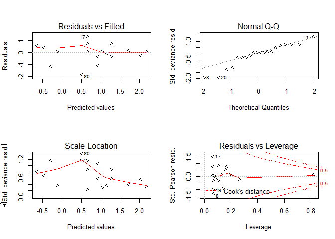

# Exercise 3


```r
#You get the temperatures recorded in 20 city weather stations of Germany on Dec 25 2013
temp = c(0,0,0,-2,-4,-5,-2,+1,-15,-3,-10,-10,+8,+7,+5,-20,0,-5,+6,+1)

# you also have the number of persons injured (sliding on an icy curb) the same day in a buffer area of 2 km around each weather station

injured = c(3,3,2,1,3,5,2,0,7,3,6,6,1,1,1,9,4,3,0,0)
```

(1)combine the 2 vectors into a dataframe called Germany; column names should be Temperatures and Injured


```r
Germany = data.frame(temp, injured)
names(Germany) = c("Temperatures", "Injured")
head(Germany)
```

```
##   Temperatures Injured
## 1            0       3
## 2            0       3
## 3            0       2
## 4           -2       1
## 5           -4       3
## 6           -5       5
```

```r
attach(Germany)
```

(2) correlation or causation?
(3) if your answer to question (2) correlation, then test for correlation and report your results including a plot.
(4) if your answer to question (2) causation, then test for it  and report your results including a plot with your predictions (you cannot use effects library). You are required to include the quadratic term of your predictor and eventually select the best model using step AIC. 


```r
# (2) causation. Lower is the temperature, higher the chance to have icy curbs and thus injured people. If you have more injured people, this is not supposed to affect the temperature recorded by the weather station.
# (3) correlation is the wrong answer.

# (4) count data (number of injured people) with just one predictor (temperature). We need to begin with a Poisson regression. 

plot(Temperatures, Injured, xlab = "Air temperature", ylab = "Number of injured people", cex = 2, pch = 20, col = 3)

model1 = glm(Injured ~ Temperatures + I(Temperatures^2), family = poisson, data = Germany)
step(model1) #Actually, step AIC suggests to retain the quadratic term. so model 1 already is our best model.
```

```
## Start:  AIC=69.59
## Injured ~ Temperatures + I(Temperatures^2)
## 
##                     Df Deviance    AIC
## <none>                   13.478 69.587
## - I(Temperatures^2)  1   15.482 69.591
## - Temperatures       1   27.542 81.651
```

```
## 
## Call:  glm(formula = Injured ~ Temperatures + I(Temperatures^2), family = poisson, 
##     data = Germany)
## 
## Coefficients:
##       (Intercept)       Temperatures  I(Temperatures^2)  
##          0.659505          -0.138638          -0.003122  
## 
## Degrees of Freedom: 19 Total (i.e. Null);  17 Residual
## Null Deviance:	    43.65 
## Residual Deviance: 13.48 	AIC: 69.59
```

```r
model1$deviance/model1$df.residual # this model looks OK, only slighly underdispersed (dispersion parameter: 0.79)
```

```
## [1] 0.7928017
```

```r
library(AER)
```

```
## Loading required package: car
## Loading required package: lmtest
## Loading required package: zoo
## 
## Attaching package: 'zoo'
## 
## The following objects are masked from 'package:base':
## 
##     as.Date, as.Date.numeric
## 
## Loading required package: sandwich
## Loading required package: survival
```

```r
dispersiontest(model1, trafo = 1) # ok, we are good here, there is no underdispersion
```

```
## 
## 	Overdispersion test
## 
## data:  model1
## z = -2.4445, p-value = 0.9927
## alternative hypothesis: true alpha is greater than 0
## sample estimates:
##      alpha 
## -0.5162488
```

```r
summary(model1)
```

```
## 
## Call:
## glm(formula = Injured ~ Temperatures + I(Temperatures^2), family = poisson, 
##     data = Germany)
## 
## Deviance Residuals: 
##     Min       1Q   Median       3Q      Max  
## -1.8321  -0.3206   0.0677   0.4696   1.2969  
## 
## Coefficients:
##                    Estimate Std. Error z value Pr(>|z|)    
## (Intercept)        0.659505   0.185547   3.554 0.000379 ***
## Temperatures      -0.138638   0.042419  -3.268 0.001082 ** 
## I(Temperatures^2) -0.003122   0.002293  -1.361 0.173363    
## ---
## Signif. codes:  0 '***' 0.001 '**' 0.01 '*' 0.05 '.' 0.1 ' ' 1
## 
## (Dispersion parameter for poisson family taken to be 1)
## 
##     Null deviance: 43.650  on 19  degrees of freedom
## Residual deviance: 13.478  on 17  degrees of freedom
## AIC: 69.587
## 
## Number of Fisher Scoring iterations: 5
```

```r
# our model clearly shows that lower temperatures affect the number of injuered people.
# The model explains roughly 34% of variability

#let's plot the predictions

plot(Temperatures, Injured, xlab = "Air temperature", ylab = "Number of injured people", cex = 2, pch = 20, col = 3)
MyData = data.frame(Temperatures = seq(-20, 8, 1))
pred = predict(model1, MyData, type="response", se = T)
lines(MyData$Temperatures, pred$fit, col = 2, lwd = 2,lty = 2)
lines(MyData$Temperatures, pred$fit + 1.96*pred$se.fit, col = 2, lwd = 1, lty = 2)
lines(MyData$Temperatures, pred$fit - 1.96*pred$se.fit, col = 2, lwd = 1, lty = 2)
```

 

```r
detach(Germany)
```

(5) do we meet model assumptions?


```r
# for sure, there is a lot of uncertainty due to low sample size (see CIs 95 in the plot for low temperatures, for instance),

# dispersion is not a problem here. 


par(mfrow = c(2,2))
plot(model1)
```

 

```r
par(mfrow = c(1, 1))
# regarding the assumptions of the linear model we fit on log-link trasnformed data, homogeneity is not fully achieved (see bottom-left plots) and, clearly, we have problem with the Cook distance and influential values. 
shapiro.test(model1$residuals) #  normality is OK.
```

```
## 
## 	Shapiro-Wilk normality test
## 
## data:  model1$residuals
## W = 0.93522, p-value = 0.1945
```

```r
#In principle, the problem here is the very low sample size, thus producing heterogeneity, and increasing it would help to meet model assumption properly.  


## alternative answers:
## if you decided to fit a quasi-poisson and get exact SE values, fine as well. 
```


